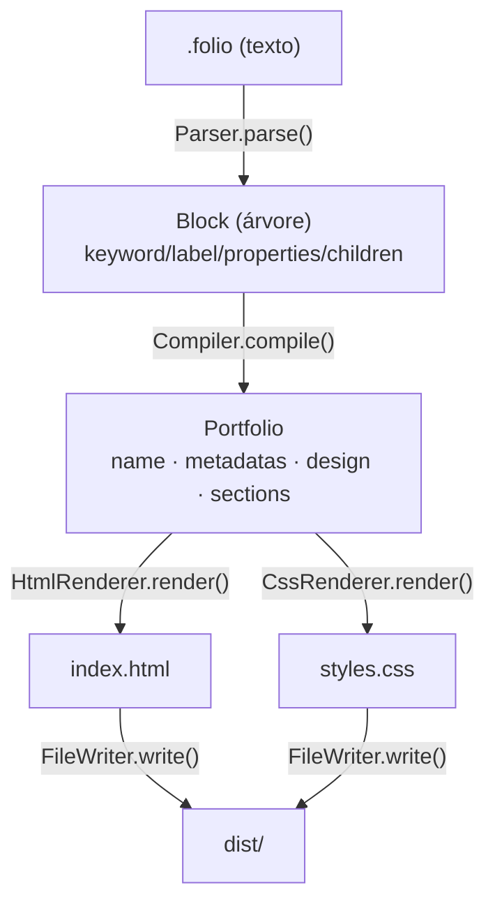
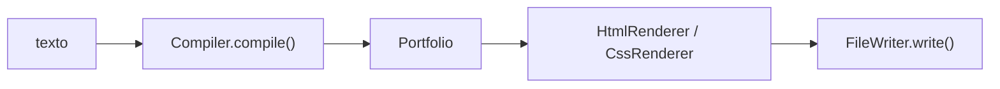

# `src/` — Guia do contribuidor

Este documento é para **quem vai alterar o FolioLang**. Se você só quer *usar* a
linguagem, leia o [`README.md` da raiz](../README.md). Aqui o foco é: como o
código está organizado, por onde a informação flui e **o que você pode mexer sem
quebrar o resto**.

> 📌 Cada subpasta importante tem seu próprio README com detalhes:
> [`compiler/`](./compiler/README.md) · [`domain/`](./domain/README.md) · [`renderers/`](./renderers/README.md)

---

## 🧠 Modelo mental em 30 segundos

O FolioLang é um pipeline de **uma direção só**, sem estado global e sem
dependências em runtime. Texto entra, dois arquivos saem:



Quem orquestra isso é o [`cli.ts`](./cli.ts) — leia-o primeiro, são ~30 linhas e
mostram o fluxo inteiro:



---

## 🗂️ Mapa das pastas

| Pasta | Papel | Quando você mexe aqui |
| --- | --- | --- |
| [`compiler/`](./compiler/README.md) | `Parser` (texto→árvore) e `Compiler` (árvore→`Portfolio`) | Mudar a **sintaxe** da linguagem |
| [`domain/`](./domain/README.md) | `Portfolio`, `types.ts`, `constants.ts` | Adicionar/alterar **o que o modelo guarda** |
| [`renderers/`](./renderers/README.md) | HTML/CSS, paletas e fontes | Mudar a **aparência** ou adicionar **seções** |
| `io/` | `FileWriter` — grava arquivos em disco | Mudar **onde/como** a saída é escrita |
| `utils/` | `dedent` — utilitário de strings | Helpers genéricos |

`io/` e `utils/` são minúsculos e estão documentados aqui mesmo (veja o fim).

---

## 🧭 As três camadas (e por que a separação importa)

A regra de ouro do projeto: **cada camada só conhece a anterior**. Respeitar isso
é o que mantém as mudanças seguras e localizadas.

1. **Compiler** (`compiler/`) — entende *texto*. Não sabe o que é HTML nem cor.
2. **Domain** (`domain/`) — guarda *dados*. Não sabe ler `.folio` nem gerar HTML.
3. **Renderers** (`renderers/`) — entende *saída*. Não sabe ler `.folio`; só lê o
   `Portfolio`.

> ⚠️ **Não pule camadas.** Se um renderer começar a interpretar sintaxe `.folio`
> crua, ou o parser começar a montar HTML, a separação quebra e bugs passam a
> aparecer longe da causa. Quando estiver na dúvida sobre onde colocar código,
> pergunte: *"isso é sobre texto, dados ou saída?"*.

---

## ⚙️ Como rodar enquanto desenvolve

```bash
npm install
npx tsx src/cli.ts example/italo.folio   # roda direto do TS, sem build
cat dist/index.html                       # inspecione a saída
```

Para validar o build de produção:

```bash
npm run build      # tsc → build/
node build/cli.js example/italo.folio
```

Não há suíte de testes automatizada hoje. **O teste é manual:** rode com
`example/italo.folio`, abra o `dist/index.html` no navegador e confira o HTML/CSS
gerado. Sempre faça isso antes de abrir um PR.

> 💡 O `Compiler.compile()` tem um `console.log(root)` que imprime a árvore
> parseada — útil para depurar a sintaxe. É um log de debug; se for removê-lo,
> tudo bem, mas saiba que vários contribuidores o usam para entender o parser.

---

## ✅ Receitas seguras (as alterações mais comuns)

Cada receita aponta para o README da pasta certa, que tem o passo a passo
detalhado. Aqui vai o resumo de **onde** mexer:

| Quero… | Mexo em | Risco |
| --- | --- | --- |
| Adicionar uma **paleta de cores** | `renderers/colors/ColorPalette.ts` | 🟢 Baixo |
| Adicionar uma **fonte** | `renderers/fonts/FontsGoogle.ts` | 🟢 Baixo |
| Renderizar uma **nova seção** (`about`, `projects`…) | `renderers/HtmlComponents.ts` + `CssComponents.ts` | 🟡 Médio |
| Renderizar mais campos de uma seção existente | `renderers/HtmlComponents.ts` | 🟢 Baixo |
| Adicionar uma **propriedade de seção** nova | `domain/types.ts` + renderer | 🟡 Médio |
| Mudar a **sintaxe** da linguagem | `compiler/Parser.ts` | 🔴 Alto |
| Mudar o **diretório de saída** | `cli.ts` (chama `FileWriter`) | 🟢 Baixo |

A regra prática: **quanto mais perto do `Parser`, maior o cuidado.** Mudanças nos
renderers e paletas são quase sempre aditivas e isoladas; mudanças no parser
afetam *toda* entrada `.folio` existente.

---

## 🚨 Armadilhas que já moram no código (leia antes de mexer)

Estas não são bugs a "consertar de passagem" — são comportamentos atuais que vão
te morder se você não souber que existem.

### 1. Todo bloco precisa de um rótulo entre aspas — exceto quando você *quer* achatá-lo

O parser reconhece tokens no formato `palavra "texto"`. Um bloco aberto **sem
rótulo** (ex.: `metadata {`) **não é reconhecido como bloco**: suas chaves são
ignoradas e o conteúdo interno é "achatado" para dentro do bloco pai.

```folio
metadata {              # SEM rótulo → conteúdo sobe para o portfolio
  lang "pt-BR"          # vira propriedade do portfolio (= metadata) ✅
}

metadata "Meta" {       # COM rótulo → vira uma SEÇÃO chamada "metadata"
  lang "pt-BR"          # NÃO vira meta tag — fica perdido ❌
}
```

É por isso que `metadata` funciona hoje: ele é intencionalmente sem rótulo, e
suas propriedades viram metadados do `portfolio`. Se você "consertar" o exemplo
adicionando um rótulo ao `metadata`, as meta tags **somem**. Veja
[`compiler/README.md`](./compiler/README.md) para o detalhe.

### 2. Valores são sempre strings entre aspas duplas

`"([^"]*)"` é a única forma de valor. Não há números, booleanos, listas nem aspas
simples. Aspas duplas dentro do valor quebram o parsing.

### 3. Não há sistema de comentários de verdade

O `#` que aparece nos exemplos do README "funciona" só porque uma linha como
`# comentário` não casa com o regex `palavra "texto"`. Mas
`# title "x"` **seria parseado** como propriedade. Não confie em `#` como
comentário ao lado de conteúdo entre aspas.

### 4. `metadatas` vs `metadata` (o "s" importa)

O `ParserHTML.getSectionsHtml` filtra seções com keyword `"metadatas"` (plural),
mas o bloco da linguagem é `metadata` (singular). Os dois nomes coexistem por
razões históricas. Se mexer em qualquer um, confira o outro.

### 5. Saída sem escape de HTML

Os renderers interpolam valores direto no HTML (`<h1>${title}</h1>`). Conteúdo do
`.folio` não é escapado. Para os fins atuais (você escreve seu próprio portfólio)
tudo bem, mas **não** trate isto como seguro para entrada não confiável.

---

## 🧩 `io/` e `utils/` (os pequenos)

**`io/FileWriter.ts`** — única ponte com o disco. `write(dir, { nome: conteúdo })`
cria o diretório (recursivo) e grava cada arquivo. Todo acesso a disco deveria
passar por aqui; não espalhe `fs.writeFileSync` pelo resto do código.

**`utils/dedent.ts`** — remove a indentação comum de strings multilinha. Os
renderers montam HTML/CSS com template strings indentadas para legibilidade e
chamam `dedent()` no fim para limpar. Se o seu HTML/CSS sair com indentação
estranha, o `dedent` (ou a falta dele) costuma ser o motivo.

---

## 📐 Convenções do código

- **TypeScript estrito**, ESM. Imports usam extensão `.js` (ex.:
  `import { Parser } from "./Parser.js"`) porque o alvo é ESM compilado — mantenha
  esse padrão mesmo importando arquivos `.ts`.
- Uma classe por arquivo, nome do arquivo = nome da classe.
- Renderers usam **herança** para separar "componentes" de "orquestração":
  `HtmlRenderer extends HtmlComponents`, `CssRenderer extends CssComponents`.
- Português nos nomes de domínio (`getVariaveisColors`) convive com inglês —
  siga o estilo do arquivo que você está editando.

---

## 🔁 Checklist antes do PR

1. `npx tsx src/cli.ts example/italo.folio` roda sem erro.
2. `npm run build` compila sem erros de tipo.
3. Abriu o `dist/index.html` e conferiu visualmente.
4. Se mexeu no parser/compiler: testou um `.folio` que **não** seja o exemplo.
5. Não vazou responsabilidade entre camadas (texto / dados / saída).
