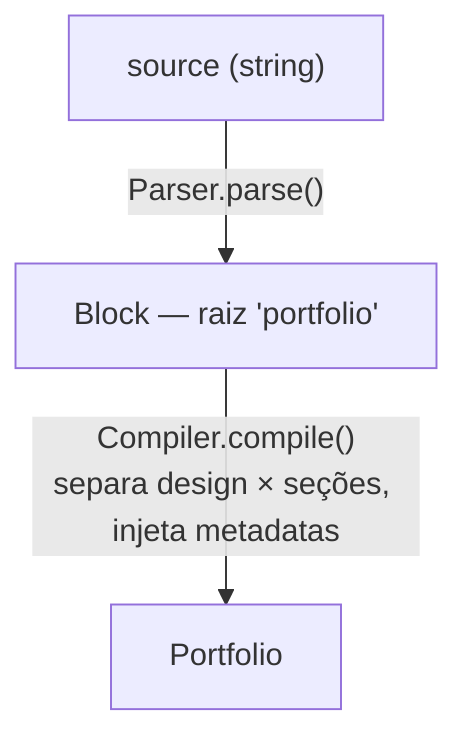

# `compiler/` — Da linguagem ao modelo

Esta pasta transforma **texto `.folio`** em um objeto **`Portfolio`**. São dois
passos, cada um numa classe:



| Arquivo | Entrada | Saída | Responsabilidade |
| --- | --- | --- | --- |
| `Parser.ts` | `string` | `Block` | Sintaxe pura: quebrar texto em blocos/propriedades |
| `Compiler.ts` | `string` | `Portfolio` | Semântica: dar significado a cada bloco |

> ⚠️ **Esta é a área de maior risco do projeto.** Uma mudança no `Parser` afeta
> *toda* entrada `.folio` que já existe. Teste com mais de um arquivo antes de
> abrir PR.

---

## `Parser.ts`

Um parser por **expressão regular + balanceamento de chaves**. Não há tokenizer
nem AST formal — é deliberadamente simples.

### A gramática que ele realmente implementa

O coração é um único token:

```
(\w+)\s+"([^"]*)"\s*(\{)?
 │        │            │
 keyword  label/valor  abre bloco? (opcional)
```

Lido como: **uma palavra, seguida de uma string entre aspas duplas, seguida
opcionalmente de `{`.**

- Sem `{` → é uma **propriedade**: `chave "valor"`.
- Com `{` → é um **bloco filho**: `keyword "rótulo" { ... }`, lido recursivamente.

`findClosingBrace()` acha o `}` correspondente contando profundidade, então blocos
aninhados funcionam normalmente.

### ⚠️ Comportamentos não óbvios (decore estes)

1. **Todo bloco precisa de um rótulo entre aspas.** `design "Aurora" {` casa;
   `design {` **não** casa o token. Um bloco sem rótulo é invisível para o
   parser: o `{`/`}` é ignorado e o conteúdo interno é **achatado no pai**.

   ```folio
   metadata {          # sem rótulo → "lang" e "favicon" viram
     lang "pt-BR"      # propriedades do PORTFOLIO, não um bloco filho
   }
   ```

   Esse achatamento é exatamente o que faz `metadata` funcionar hoje. Não é
   acidente que dá pra explorar de propósito — é a razão de o `metadata` não ter
   rótulo no exemplo. Se você um dia introduzir validação de "todo bloco precisa
   de rótulo", **vai quebrar o `metadata`** sem rota alternativa.

2. **Valores são só strings entre aspas duplas.** Sem números, listas, aspas
   simples ou aspas escapadas. `"` dentro do valor encerra o valor.

3. **Não há comentários.** `#` "funciona" por acidente (linhas de comentário não
   casam o regex), mas qualquer `#` antes de um `palavra "texto"` na mesma linha
   será parseado. Não documente `#` como recurso oficial.

4. **A raiz é obrigatória.** Sem `portfolio "Nome" {` no começo, lança
   `Esperado: portfolio "Seu Nome"`.

5. **Chaves desbalanceadas** lançam `Bloco não fechado. Está faltando }`.

### Como estender a sintaxe com segurança

- **Aceitar `'aspas simples'` também:** ajuste o regex em dois lugares (`parse` e
  `parseBlockBody`) — mas cuidado, hoje `'` é literal dentro de URLs etc.
- **Suportar valores não-string:** prefira manter tudo string aqui e converter no
  `Compiler`/renderer. O `Block.properties` é `Record<string, string>` por
  design; mudar isso reverbera em todo o código.
- **Comentários de verdade:** faça um *pré-processamento* que remove linhas/sufixos
  de comentário **antes** do parse, em vez de complicar o regex.
- Sempre que mexer no regex, teste: bloco vazio (`design "X" {}`), bloco aninhado,
  propriedade com caracteres especiais (URLs!), e o `metadata` sem rótulo.

---

## `Compiler.ts`

Fino de propósito. Ele dá **significado** aos blocos que o `Parser` produziu:

```ts
const root = parser.parse(source);          // Block raiz "portfolio"
const portfolio = new Portfolio(root.label);

for (const section of root.children) {
  if (section.keyword === "design") portfolio.setDesign(section);  // design é especial
  else portfolio.addSection(section);                              // resto = seção
}

portfolio.addMetadatas(root.properties);    // props da raiz (= metadata achatado)
```

Pontos-chave:

- **`design` é tratado à parte** — vira `portfolio.design`, não entra em `sections`.
  Todo outro bloco filho vira uma seção genérica.
- **Metadados vêm de `root.properties`** — ou seja, do bloco `metadata` achatado
  (veja o item 1 do Parser). Se o `metadata` ganhar rótulo, ele cai em `sections`
  e o `addMetadatas` recebe vazio.
- Há um `console.log(root)` de debug. É intencional para inspecionar a árvore;
  remova com consciência.

### Como adicionar um bloco "especial" (como o `design`)

Se um novo bloco precisar de tratamento próprio (ex.: um bloco `fonts`
configurável), adicione outro `if (section.keyword === "...")` aqui e um campo
correspondente no `Portfolio` (veja [`domain/README.md`](../domain/README.md)).
Para blocos que são só "mais uma seção a renderizar", **não mexa no Compiler** —
basta tratá-los no renderer.

---

## Onde NÃO colocar código aqui

- ❌ Nada de HTML/CSS — isso é trabalho dos `renderers/`.
- ❌ Nada de acesso a disco — isso é do `io/FileWriter`.
- ❌ Evite lógica de apresentação (cores, fontes, layout) — o compiler só monta
  dados.
