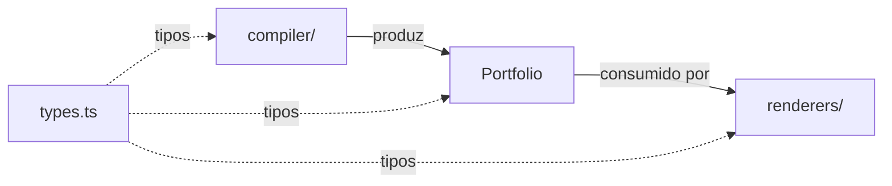
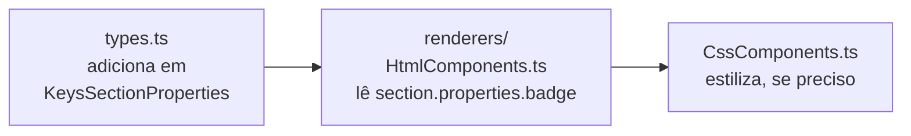
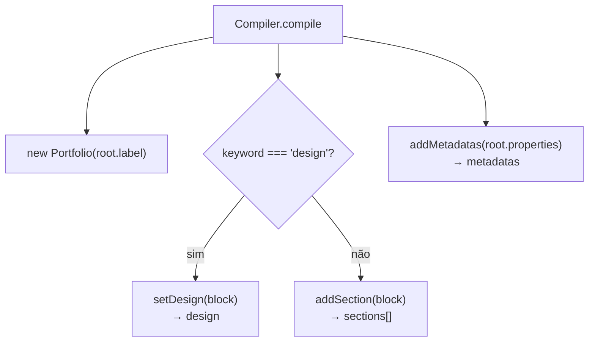

# `domain/` — O modelo de dados

Esta pasta é o **centro neutro** do projeto: estruturas de dados puras, sem ler
`.folio` e sem gerar HTML. O `compiler/` produz esses dados; o `renderers/` os
consome.



| Arquivo | O que é |
| --- | --- |
| `types.ts` | Todos os tipos, interfaces e enums compartilhados |
| `Portfolio.ts` | A classe que representa um portfólio compilado |
| `constants.ts` | Constantes de configuração (hoje, só `propertyKeysExcludeMeta`) |

---

## `types.ts` — o contrato de todo o projeto

Quase todo arquivo importa daqui. Mudar um tipo aqui é a forma mais rápida de
propagar uma intenção por todo o código — e também a mais rápida de quebrar tudo.
Mexa com cuidado.

### `Block` — a unidade do parser

```ts
interface Block<T extends string = string> {
  keyword: string;                  // ex.: "hero", "design", "metadata"
  label: string;                    // o texto entre aspas
  properties: Record<T, string>;    // chave → valor (sempre string!)
  children: Block<T>[];             // blocos aninhados
}
```

Tudo que sai do `Parser` é uma árvore de `Block`. O genérico `T` permite "estreitar"
as chaves esperadas (ex.: `Block<KeysSectionProperties>`) sem mudar a estrutura.

### Enums e uniões de chaves

| Tipo | Para que serve |
| --- | --- |
| `SectionType` | Nomes canônicos de seções (`hero`, `about`, `projects`, `contact`, `metadatas`) |
| `ColorName` | As 5 cores de uma paleta (`ink`, `line`, `text`, `muted`, `accent`) |
| `FontsFamily` | Identificadores de fonte (`space-grotesk`, `ibm-plex-mono`) |
| `KeysSectionProperties` | Propriedades válidas de uma seção (`title`, `subtitle`, `description`, `image`, `link`) |
| `KeysMetadataProperties` | Chaves de metadados reconhecidas |
| `PaletteSet` | `Record<ColorName, string>` — um conjunto completo de cores |
| `DesignConfig` | `{ palette: string, colors: Partial<PaletteSet> }` — resultado do bloco `design` |

> ⚠️ **`SectionType` é declarativo, não obrigatório.** O parser aceita *qualquer*
> keyword; esses enums só documentam o que é esperado e ajudam o TypeScript. Um
> bloco `foo "x" {}` será parseado e virará uma seção — só não será renderizado
> (o `HtmlComponents.takeSection` retorna `""` para keywords desconhecidas).

### Como adicionar uma propriedade de seção (ex.: `badge`)



1. Some `"badge"` à união `KeysSectionProperties`.
2. Leia `section.properties.badge` no renderer da seção.
3. Não precisa tocar no `Parser`/`Compiler` — eles já carregam qualquer
   propriedade genericamente.

---

## `Portfolio.ts` — o modelo compilado

Representa um `.folio` já interpretado. É o **único objeto** que os renderers
recebem.

```ts
class Portfolio {
  name: string;                          // rótulo do bloco portfolio
  metadatas: Record<string, string>;     // meta tags (do bloco metadata achatado)
  sections: Block[];                     // todo bloco que não é "design"
  design: DesignConfig;                  // paleta + sobrescritas de cor
  style: Record<string, string>;         // reservado (ver nota)
}
```

Fluxo de preenchimento (quem chama o quê, no `Compiler`):



Métodos:

| Método | O que faz |
| --- | --- |
| `addSection(block)` | Empilha um bloco em `sections` |
| `setDesign(block)` | `label` vira a paleta; `properties` viram sobrescritas de cor |
| `addMetadatas(props)` | Mescla propriedades em `metadatas` |
| `addStyle(props)` | Mescla em `style` (atualmente **não usado** no pipeline) |
| `toString()` / `describe()` | Resumo legível para debug |

> ℹ️ `style` e `addStyle` existem mas ainda não são consumidos por nenhum
> renderer. São um ponto de extensão pré-fabricado — útil se você for adicionar
> estilos por-portfólio. Não os remova achando que é código morto sem antes
> checar o roadmap.

### Regra de ouro

O `Portfolio` **não conhece HTML nem CSS**. Se você sentir vontade de colocar uma
tag ou uma regra de cor aqui, ela pertence ao `renderers/`. Mantenha esta classe
como dados puros + pequenos helpers de leitura.

---

## `constants.ts`

Hoje só exporta:

```ts
export const propertyKeysExcludeMeta = ["lang"];
```

É a lista de chaves de metadados que **não** devem virar `<meta>` tags. O `lang`
está aqui porque ele vira o atributo `<html lang="...">`, não uma meta tag. Se
você adicionar metadados com tratamento especial (ex.: `theme-color` que vira
outra coisa), some-os a esta lista e trate no `renderers/HtmlParser.ts`.
