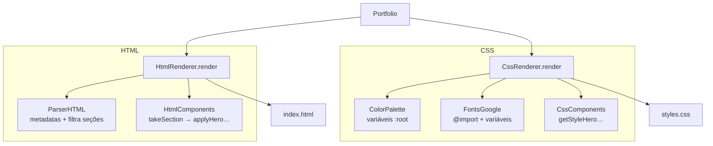
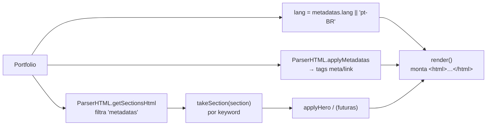
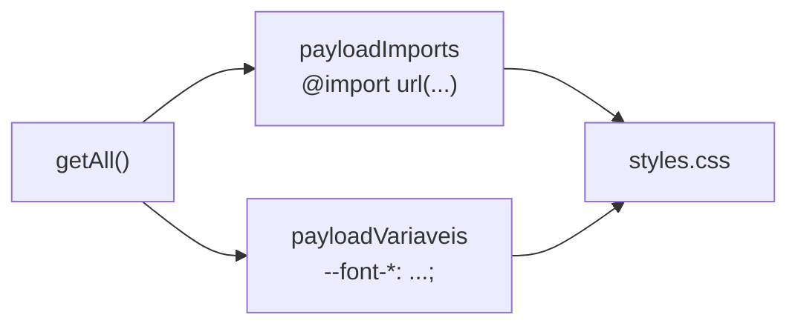
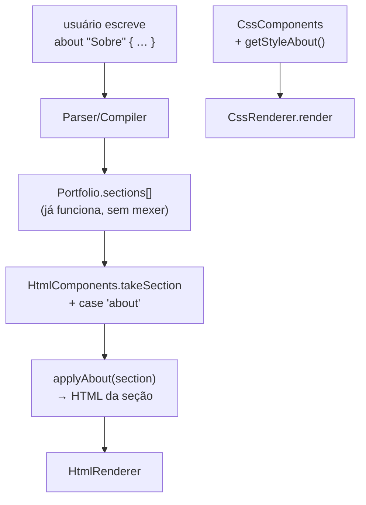
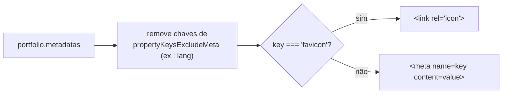

# `renderers/` — Do modelo aos arquivos

Esta pasta transforma um **`Portfolio`** em duas strings: o `index.html` e o
`styles.css`. É a camada que você mais vai mexer ao contribuir, porque é onde mora
toda a **aparência** e onde se adicionam **novas seções**.



| Arquivo | Papel |
| --- | --- |
| `HtmlRenderer.ts` | Monta o documento HTML completo (`<html>…</html>`) |
| `HtmlComponents.ts` | Gera o HTML de **cada seção** (`hero`, …) |
| `HtmlParser.ts` (`ParserHTML`) | Transforma metadados em `<meta>`/`<link>` e filtra seções |
| `CssRenderer.ts` | Monta a folha de estilo completa |
| `CssComponents.ts` | Gera o CSS de **cada seção** |
| `colors/ColorPalette.ts` | Conjuntos de cores + sobrescritas → variáveis `:root` |
| `fonts/FontsGoogle.ts` | `@import` de fontes + variáveis `--font-*` |

> 🧱 **Padrão de herança:** `HtmlRenderer extends HtmlComponents` e
> `CssRenderer extends CssComponents`. O *Renderer* orquestra o documento inteiro;
> o *Components* sabe gerar pedaços (seções). Mantenha pedaço de seção no
> Components, e moldura do documento no Renderer.

> 🧹 **`dedent`:** os renderers escrevem template strings indentadas (legíveis no
> código) e chamam `dedent()` no fim para limpar a indentação. Se sua saída sair
> torta, é o `dedent` — veja [`utils/dedent.ts`](../utils/dedent.ts).

---

## Como o HTML é montado



`HtmlComponents.takeSection()` é um `switch` por `keyword`. Hoje só `hero` tem
implementação; o `default` retorna `""` (seções desconhecidas são silenciosamente
ignoradas).

---

## 🟢 Receita: adicionar uma paleta de cores

Arquivo: `colors/ColorPalette.ts`. **É a mudança mais segura do projeto** —
puramente aditiva.

```ts
private readonly palettes: Record<string, PaletteSet> = {
  // …existentes…
  Sunset: {
    ink: "#1A1014",
    line: "rgba(255, 200, 180, 0.10)",
    text: "#FFF1E6",
    muted: "#C9A89B",
    accent: "#FF6B5B",
  },
};
```

- Forneça **as 5 cores** (`ColorName`): `ink`, `line`, `text`, `muted`, `accent`.
- O nome da chave (`Sunset`) é o que o usuário escreve em `design "Sunset" {}`.
- A resolução é *case-insensitive*; nome inexistente cai em `Principal`.
- Sobrescritas inválidas do usuário são filtradas por `sanitizeOverrides()` —
  você não precisa validar nada.

---

## 🟢 Receita: adicionar uma fonte

Arquivo: `fonts/FontsGoogle.ts`.

1. Adicione o identificador em `FontsFamily` (em [`domain/types.ts`](../domain/types.ts)).
2. Crie um método `getMinhaFonte(): StructFont` com `font`, `url`, `family`,
   `fallback`.
3. Inclua-o no array de `getAll()`.

O construtor monta automaticamente os `@import` e as variáveis `--font-*` a partir
de `getAll()` — não há mais nada a ligar. Use no CSS com
`font-family: var(--font-minha-fonte)`.



---

## 🟡 Receita: renderizar uma nova seção (ex.: `about`)

Esta é a contribuição mais valiosa do roadmap. Toca **dois** arquivos e segue um
padrão claro.



**Passo 1 — HTML.** Em `HtmlComponents.ts`:

```ts
protected takeSection(section: Block): string {
  switch (section.keyword) {
    case "hero":  return this.applyHero(section);
    case "about": return this.applyAbout(section);   // ← novo
    default:      return "";
  }
}

protected applyAbout(section: Block<KeysSectionProperties>): string {
  const { title, description } = section.properties;
  return `
    <section label="${section.label}" class="about">
      <h2>${title ?? ""}</h2>
      <p>${description ?? ""}</p>
    </section>
  `.trim();
}
```

**Passo 2 — CSS.** Em `CssComponents.ts`, crie `getStyleAbout()` e chame-o no
`CssRenderer.render()` (do lado do `getStyleHero()`).

**Cuidados:**

- Use as propriedades de `KeysSectionProperties`. Se precisar de uma nova,
  adicione-a primeiro em `domain/types.ts` (veja o [README de domain](../domain/README.md)).
- O parser/compiler **não precisa de alterações** — toda seção já chega em
  `Portfolio.sections`. Você só precisa ensinar o renderer a desenhá-la.
- Trate propriedades ausentes (`?? ""`): o usuário pode omitir campos.
- Mantenha o `label="${section.label}"` e uma `class` igual à keyword, por
  consistência com o `hero`.

---

## 🟡 Como os metadados viram tags

`HtmlParser.ts` (`ParserHTML`):



- `lang` é excluído (vira `<html lang>`), via `constants.ts`.
- `favicon` vira `<link rel="icon">`; o resto vira `<meta>`.
- Para um metadado com tratamento especial novo, adicione um `case` em
  `getTagMetadatas()` e, se ele não deve virar `<meta>`, liste-o em
  `propertyKeysExcludeMeta`.

> 🐞 **Gotcha:** `getSectionsHtml()` filtra seções com keyword `"metadatas"`
> (plural), mas o bloco da linguagem é `metadata` (singular) — e ele nem chega
> como seção, pois é "achatado" no `portfolio` (veja
> [`compiler/README.md`](../compiler/README.md)). Os dois nomes coexistem por
> história; ao mexer em um, confira o outro.

---

## 🔴 Cuidados gerais de segurança

- **Sem escape de HTML.** Valores são interpolados crus (`<h1>${title}</h1>`).
  Bom para uso pessoal; **não** confie em entrada de terceiros.
- **Não leia `.folio` aqui.** Renderers só conhecem o `Portfolio`. Se precisar de
  um dado novo, exponha-o no modelo de domínio, não parseie texto no renderer.
- **Não escreva em disco aqui.** `render()` retorna string; quem grava é o
  `io/FileWriter` (chamado pelo `cli.ts`).
- Sempre rode `npx tsx src/cli.ts example/italo.folio` e abra o `dist/index.html`
  depois de mexer — não há testes automatizados.
